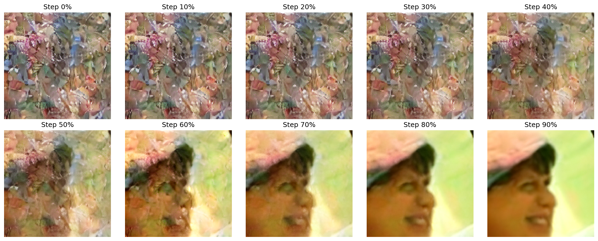
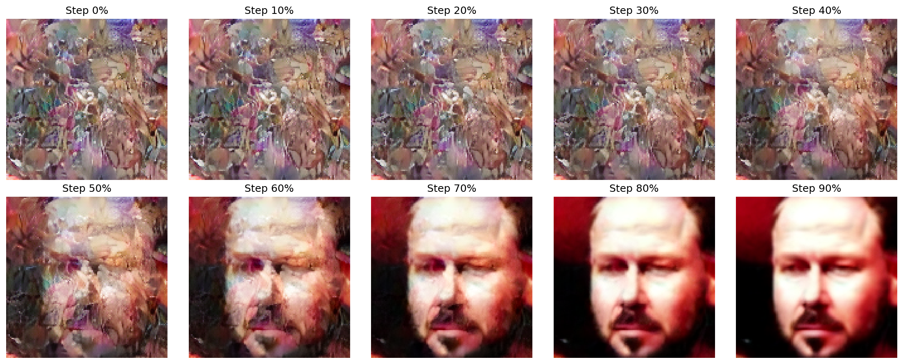
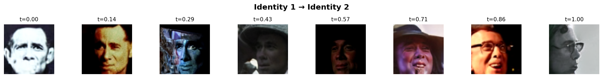
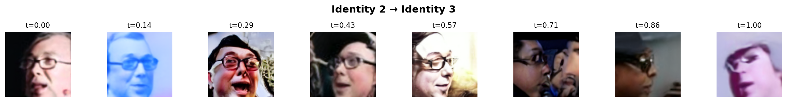
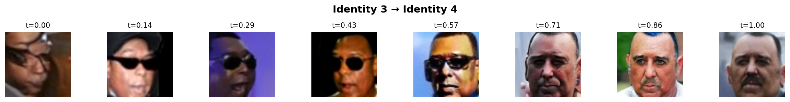

# UIFace-Plus-homework: 扩散模型人脸生成可视化与插值系统

**生成模型课程作业**

基于扩散模型的人脸生成系统，实现了生成过程可视化和身份插值功能。

---

## 1. 项目简介

本项目基于 ICLR 2025 论文 [UIFace](https://openreview.net/forum?id=riieAeQBJm) 的扩散模型，实现了人脸生成的**可视化**和**插值**功能。

### 主要贡献

1. **扩散过程可视化** - 展示从噪声到人脸的去噪步骤
2. **身份插值** - 实现两个身份之间的平滑过渡（支持 SLERP 和线性插值）
3. **优化的采样算法** - 集成 Classifier-Free Guidance (CFG) 提升生成质量
4. **完整的代码实现** - 可直接运行的人脸生成系统

### 技术栈

- **扩散模型**: DDIM (Denoising Diffusion Implicit Models)
- **潜在编码**: VQ-VAE (Vector Quantized Variational AutoEncoder)
- **条件生成**: 基于身份嵌入向量的条件控制
- **插值方法**: 球面线性插值 (SLERP) 和线性插值 (LERP)

---

## 2. 环境配置与运行

### 环境要求

- Python 3.8+
- PyTorch 1.12+
- CUDA 11.3+ (可选，推荐使用 GPU)

### 安装依赖

```bash
# 进入项目目录
cd UIFace-Plus

# 安装依赖包
pip install -r requirements.txt
```

### 下载预训练模型

下载以下模型文件并放置在 `UIFace-Plus/models/` 目录下：

| 文件 | 说明 | 下载链接 |
|------|------|----------|
| `ema_averaged_model_250000.ckpt` | UIFace 扩散模型 | [Google Drive](https://drive.google.com/drive/folders/11OnYj0mtEkepjl3gE2oLeDJu_WeuB0Ma) |
| `first_stage_encoder_state_dict.pt` | VQ-VAE 编码器 | [Google Drive](https://drive.google.com/drive/folders/1d-zs3yjsnzOMNkz7qy3JSb-fMf0UmSdT) |
| `first_stage_decoder_state_dict.pt` | VQ-VAE 解码器 | 同上 |

### 运行脚本

#### 方式一：生成人脸并可视化扩散过程

```bash
python generate_with_visualization.py
```

**功能**: 生成 5 张人脸，并保存每张人脸的去噪过程可视化

#### 方式二：身份插值实验

```bash
python identity_interpolation.py
```

**功能**: 在 4 个不同身份之间进行插值，每对身份生成 8 步过渡图像

### 可选参数

```bash
# 身份插值 - 自定义参数
python identity_interpolation.py \
    --checkpoint models/ema_averaged_model_250000.ckpt \
    --vq_encoder models/first_stage_encoder_state_dict.pt \
    --vq_decoder models/first_stage_decoder_state_dict.pt \
    --num_identities 5 \
    --num_steps 10
```

---

## 3. 期望输出

### 输出目录结构

```
outputs/
├── generation/              # 人脸生成结果
│   ├── face_1_final.png     # 生成的人脸图像
│   ├── face_2_final.png
│   ├── ...
│   ├── face_1_denoising_process.png  # 去噪过程可视化
│   └── ...
│
└── interpolation/           # 插值结果
    ├── interpolation_1_to_2.png      # 身份1→2的插值可视化
    ├── interpolation_2_to_3.png
    ├── ...
    └── id1_to_id2_step*.png          # 单独的插值步骤图像
```

### 输出说明

#### 1. 人脸生成 (`outputs/generation/`)

- **`face_X_final.png`**: 最终生成的高质量人脸图像 (128×128)
- **`face_X_denoising_process.png`**: 去噪过程可视化，包含 10 个关键步骤，展示从噪声到清晰人脸的转变

**生成的人脸样例**:

<div align="center">
    
</div>

**去噪过程可视化样例**:

从噪声到清晰人脸的完整去噪过程：

<div align="center">

</div>

<div align="center">

</div>

#### 2. 身份插值 (`outputs/interpolation/`)

- **`interpolation_X_to_Y.png`**: 身份 X 到 Y 的完整插值序列可视化
- **`idX_to_idY_stepN.png`**: 插值的单个步骤图像

**身份插值可视化样例**:

身份 1 到身份 2 的平滑过渡：

<div align="center">

</div>

身份 2 到身份 3 的平滑过渡：

<div align="center">

</div>

身份 3 到身份 4 的平滑过渡：

<div align="center">

</div>

### 性能参数

| 参数 | 数值 |
|------|------|
| 生成分辨率 | 128×128 pixels |
| 采样步数 | 50 steps (DDIM) |
| CFG Scale | 1.5 |
| GPU 生成速度 | ~5-10秒/张 (RTX 3060) |
| CPU 生成速度 | ~1-2分钟/张 |

---

## 核心技术实现

### 1. Classifier-Free Guidance (CFG)

在采样过程中同时预测条件和无条件噪声，通过线性组合增强条件控制：

```python
noise_pred = (1 + cfg_scale) * noise_pred_cond - cfg_scale * noise_pred_uncond
```

**改进效果**: 提升生成质量和身份一致性

### 2. 球面线性插值 (SLERP)

在高维潜在空间中，SLERP 比线性插值保持更好的几何性质：

```python
def slerp(v0, v1, t):
    theta = arccos(v0 · v1)
    return sin((1-t)θ)/sinθ * v0 + sin(tθ)/sinθ * v1
```

**改进效果**: 插值路径更平滑，中间图像质量更高

### 3. 动态 Latent 尺寸计算

自动计算 VQ-VAE 的 latent 空间尺寸，而非硬编码：

```python
dummy_input = torch.ones([1, 3, 128, 128])
latent_shape = vq_encoder(dummy_input).shape[1:]  # 动态获取
```

**改进效果**: 代码更健壮，适配不同的编码器配置

---

## 项目结构

```
UIFace-Plus/
├── README.md                          # 项目文档
├── requirements.txt                   # Python 依赖
│
├── generate_with_visualization.py     # 人脸生成 + 可视化
├── identity_interpolation.py          # 身份插值实验
│
├── models/                            # 预训练模型（需下载）
│   ├── ema_averaged_model_250000.ckpt
│   ├── first_stage_encoder_state_dict.pt
│   └── first_stage_decoder_state_dict.pt
│
└── outputs/                           # 输出目录
    ├── generation/                    # 生成结果
    └── interpolation/                 # 插值结果
```

---

## 参考文献

1. **UIFace**: Xiao Lin et al. "UIFace: Unleashing Inherent Model Capability to Enhance Intra-Class Diversity in Synthetic Face Recognition". ICLR 2025. [Paper](https://openreview.net/forum?id=riieAeQBJm)

---